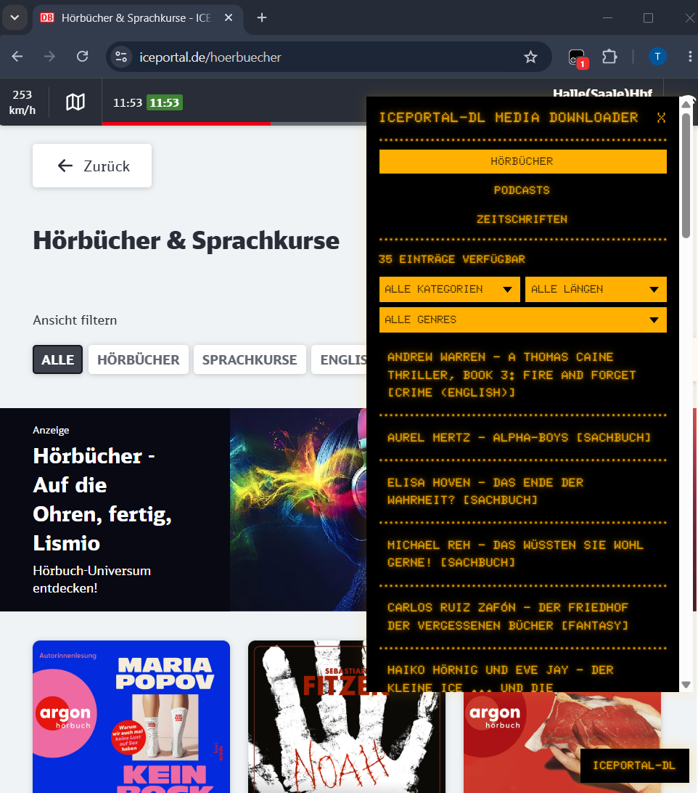

# ICEportal-dl Media Downloader

> [🇩🇪 Deutsche Version](README.de.md)

A userscript that helps when downloading media (audiobooks, podcasts, magazines) from the ICEportal of Deutsche Bahn. To make the wait time for connecting trains pass more quickly.

- Lists audiobooks, podcasts, and magazines
- Filter options (category, genre, time)
- Sets useful filenames
- Adds metadata (audiobooks)
- Optionally combines many small audio files into one large file (audiobooks)

## Installation

1. Install a userscript manager, e.g., [Tampermonkey](https://www.tampermonkey.net/).
2. Install the script: [iceportal-dl.user.js](https://raw.githubusercontent.com/Jo11n/iceportal-dl/main/iceportal-dl.user.js)
3. In the train's WiFi, open [iceportal.de](https://iceportal.de); a button will appear in the bottom right corner.

## Scope

Videos (DRM) are out of scope.

## Inspiration Sources / Alternatives

- [https://github.com/julijane/iceportal-leecher](https://github.com/julijane/iceportal-leecher) (Go)
- [https://github.com/ddrews-de/iceportal-downloader](https://github.com/ddrews-de/iceportal-downloader) (Python)
- [https://github.com/alexanderadam/train_portal_downloader](https://github.com/alexanderadam/train_portal_downloader) (Ruby)

## Changes

[changelog](CHANGELOG.md)